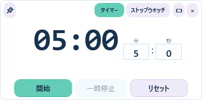
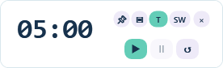

# ChoiTimer

ChoiTimerは、Windows向けのコンパクトなタイマー／ストップウォッチです。通常表示とミニ表示を切り替えられ、常に最前面へ固定してデスクトップウィジェットのように利用できます。

## ダウンロード

最新版はこちらからダウンロードできます。

[ChoiTimer v1.0.0 をダウンロード](https://github.com/Colours0/ChoiTimer/releases/latest)

## スクリーンショット

## 主な機能

- 分・秒指定のカウントダウン、開始、一時停止、再開、リセット
- `00:00.00`形式のストップウォッチ
- 画面内の終了メッセージとアプリ内通知音
- 前回使用した分・秒の自動復元
- 常に最前面のピン切替と右クリックメニュー
- 340×169の通常表示、276×84のミニ表示
- `Enter`で開始、`Space`で一時停止／再開、`Esc`でリセット

## 配布版の実行

ソースコードは公開していません。Windows x64向けの`ChoiTimer.exe`は、[GitHub Releases](https://github.com/Colours0/ChoiTimer/releases)からダウンロードして実行してください。配布版には.NETランタイムと通知音が含まれるため、別途.NETをインストールする必要はありません。

設定は`%LocalAppData%\ChoiTimer\settings.json`へ保存されます。設定が存在しない場合や破損している場合は5分へ戻ります。

## ライセンス

利用条件は[TERMS.md](TERMS.md)をご確認ください。個人利用は無料ですが、商用利用および再配布（改変版を含む）は禁止されています。
